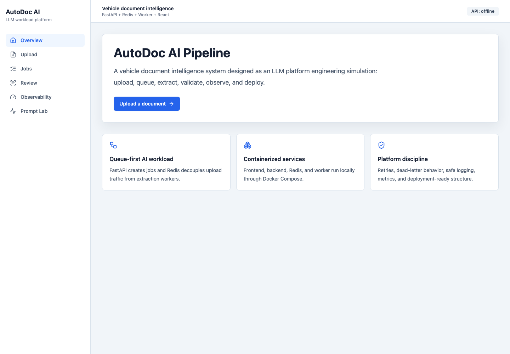
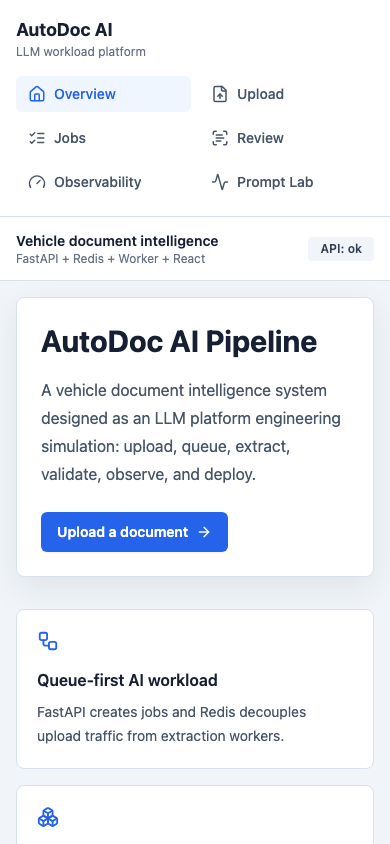

# AutoDoc AI Pipeline

AutoDoc AI Pipeline is a recruiter-ready LLM platform engineering simulation for vehicle document intelligence. It runs a local multi-service AI workload with a React dashboard, FastAPI backend, Redis queue, and Python extraction worker.

## Why This Exists

The goal is to show platform thinking around AI workloads: queueing, retries, worker isolation, validation, observability, deployment manifests, CI/CD, and safe operations. The project starts mock-first so it is free to run without paid API keys, while leaving a clean path for future OpenAI or Gemini-backed extraction.

## Local Quick Start

```bash
docker compose up --build
```

To include Prometheus and Grafana:

```bash
docker compose --profile observability up --build
```

Open:

- Frontend: http://127.0.0.1:3000
- Backend API: http://127.0.0.1:8000/health
- Prometheus metrics: http://127.0.0.1:8000/metrics
- Worker metrics: http://127.0.0.1:9100/metrics
- Grafana: http://127.0.0.1:3001
- Prometheus: http://127.0.0.1:9090

## Public Vercel Demo

This repo includes a Vercel Services configuration for a free public demo. Import the repository in Vercel, keep **Application Preset** set to **Services**, and deploy from the repository root. The committed demo environment uses browser-safe mock extraction so recruiters can upload a sample document, review normalized JSON, and inspect observability without Redis, Docker Compose, or paid model APIs.

See [docs/VERCEL_DEMO.md](docs/VERCEL_DEMO.md) for the exact dashboard steps and demo-mode explanation.

## Current Flow

```text
Upload vehicle document
  -> FastAPI saves file and creates job
  -> Redis queues the job
  -> Python worker processes the job
  -> Mock extraction result is written as JSON
  -> React dashboard shows status and review data
```

## Tech Stack

- React, TypeScript, Vite, Tailwind CSS
- FastAPI, Pydantic, Uvicorn
- Redis queue and job store
- Python worker service
- Prometheus-compatible metrics
- Docker Compose
- Kubernetes manifests
- GitHub Actions and Trivy

## Repository Guide

- [AI_ENGINEERING_ROADMAP.md](AI_ENGINEERING_ROADMAP.md): first-person engineering case study.
- [PROJECT_BRIEF.md](PROJECT_BRIEF.md): concise portfolio brief.
- [docs/ARCHITECTURE.md](docs/ARCHITECTURE.md): system diagram and service responsibilities.
- [docs/RUNBOOK.md](docs/RUNBOOK.md): operational troubleshooting guide.
- [docs/SECURITY.md](docs/SECURITY.md): safe logging, secrets, and scanning notes.
- [docs/VERIFICATION.md](docs/VERIFICATION.md): tests, Docker Compose, and upload-to-worker proof.
- [docs/AWS_DEPLOYMENT_PLAN.md](docs/AWS_DEPLOYMENT_PLAN.md): cloud deployment direction.
- [docs/INTERVIEW_NOTES.md](docs/INTERVIEW_NOTES.md): recruiter/interview talking points.

## Demo Screenshots





## CI/CD

GitHub Actions runs Python lint/tests, frontend build, Docker image build checks, and a Trivy filesystem scan.

## Kubernetes

Kubernetes manifests live in `infra/k8s/` and include frontend, backend, worker, Redis, ConfigMap, Secret example, and worker HPA. The HPA uses CPU for a simple local-compatible example; the docs explain how queue-depth scaling would work with KEDA or custom metrics.

## Demo Data

Text-like files are best for the local demo. Try a `.txt` file containing:

```text
VIN 1HGCM82633A004352
Odometer 84250
Brake inspection completed for Honda Accord.
```
