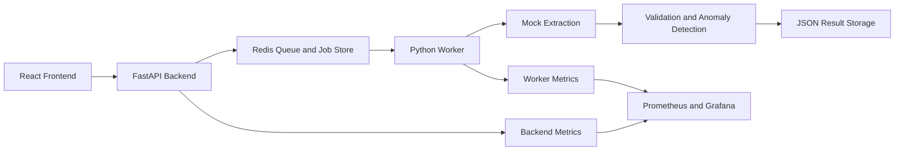

# Architecture

## Services

- Frontend: uploads documents, shows job lifecycle, reviews extraction JSON, and visualizes health metrics.
- Backend: accepts uploads, persists files, creates jobs, pushes queue messages, and serves job/result APIs.
- Redis: stores job records and queue messages for local development.
- Worker: polls Redis, runs mock extraction, validates results, writes JSON output, and updates job state.

## Job Lifecycle

`queued -> processing -> completed` is the happy path. Failures retry until the configured attempt limit, then move to `dead_letter` for review.

